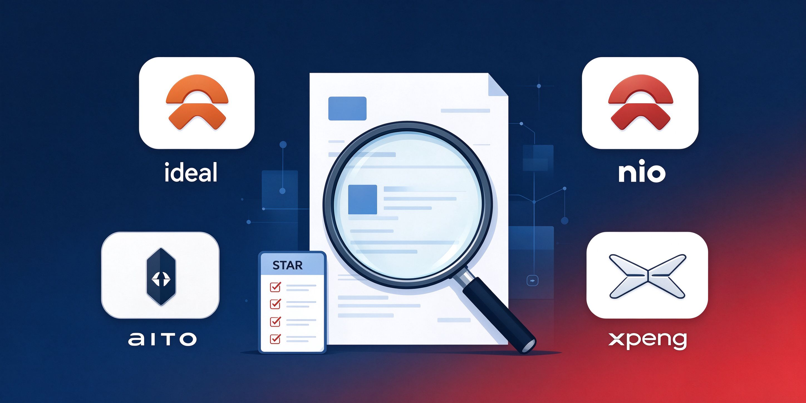

# automotive-job-hunting-framework

**新能源汽车求职：主机厂 JD 拆解 + STAR 应答 + 简历优化 + 行动清单。**

  

[目标岗位](#目标岗位) · [JD拆解](#jd拆解方法)

---

## 目标岗位

| 品牌 | 岗位 | 关键词 |
|------|------|--------|
| 理想 | 区域运营经理 | 培训体系、门店检核、NPS |
| 蔚来 | 培训管理 | 课程开发、知识库、NIO Academy |
| 问界 | 售后培训 | 技术认证、鸿蒙座舱、ADS |
| 小鹏 | 服务培训 | 服务中心、流程标准化 |

## JD拆解方法

1. 提取 3 个核心职责
2. 匹配自身经历（STAR 结构）
3. 补差异化亮点
4. 准备面试行动清单

## License

MIT
